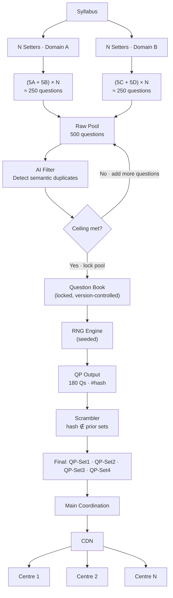
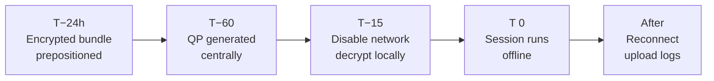
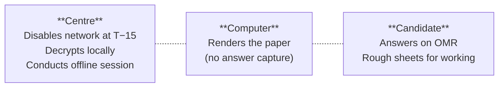
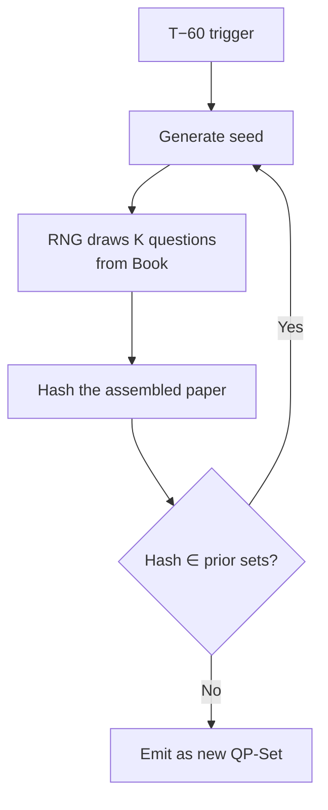

# CBT Hybrid Examination — Architecture Brief

**Version:** v0.1 — Conceptual Release
**License:** MIT
**Status:** Open-source conceptual model. No real organisation, board, or institution is referenced.

This document describes the conceptual architecture of a large-scale Computer-Based Test (CBT) Hybrid Examination system. It is a systems proposal, intended to be read, critiqued, forked, and adapted. It is not an implementation guide for any specific exam.

## A. Project overview

### A.1 What this is

The CBT Hybrid Examination Model is a conceptual blueprint for conducting large-scale, secure examinations where:

- the question paper is **compiled early** by domain contributors,
- **deduplicated** by an AI filter and locked as a versioned question book,
- **generated late** (one hour before the exam) using a seeded RNG plus a non-collision Scrambler,
- **distributed via CDN** to exam centres as sealed, encrypted packages,
- **rendered** on a locked-down terminal at the centre,
- and **answered on a paper OMR sheet** — never captured digitally by the candidate.

The model is "hybrid" in delivery, not in question format. Computers display questions; paper records answers.

### A.2 Why the model exists

At scale, traditional paper-based exams rely on physical secrecy: sealed envelopes, last-minute printing, courier logistics. Each handoff is a potential leak point, costly to audit and slow to react to. Fully digital exams introduce a different attack surface — screen capture, network-mediated assistance, partial reconstruction from intercepted traffic.

This model attempts to reduce leak surface by:

- ensuring **no complete question paper exists** until one hour before the exam,
- producing **multiple non-overlapping sets** so a single leak does not compromise others,
- **fingerprinting** every generated set cryptographically,
- keeping the **answer record physical** so candidate input never crosses the digital boundary,
- taking the hall **offline** before decryption, removing online aid as a vector during the session.

### A.3 Positioning

This is a neutral, open-source, technical proposal. Every parameter is a variable; every stage is replaceable. The goal is a shared vocabulary for reasoning about exam security and scale, not a single canonical implementation.

## B. Examination workflow overview

The lifecycle progresses through six operational stages:

| # | Stage | Purpose |
|---|---|---|
| 1 | **Compile** | Domain contributors submit questions per fixed quota. |
| 2 | **Filter** | AI deduplication; ceiling check ensures pool meets quality threshold. |
| 3 | **Book** | Locked, version-controlled question pool with metadata per item. |
| 4 | **Generate** | At T−60, RNG draws a paper; Scrambler ensures no collision with prior sets. |
| 5 | **Deliver** | Main coordination node ships sealed sets to centres via CDN. |
| 6 | **Execute** | At T−15, centre disables network and decrypts locally; session runs offline; OMR is collected after. |

Each stage is independently swappable. The architecture is intentionally modular.

## C. Examination system architecture

### C.1 Question compilation (Stage 1)

- `N` setters per domain submit a fixed quota per cycle.
- Reference parameters (illustrative):
  - 25 setters in a technical/science domain × 10 questions each (e.g. 5 Physics + 5 Chemistry) = **250 questions**
  - 25 setters in a life-science domain × 10 questions each (e.g. 5 Botany + 5 Zoology) = **250 questions**
  - Total raw pool = **500 questions**
- All parameters — `N`, quota per setter, subject groupings, domain count — are configurable variables.

### C.2 AI filter and ceiling matching (Stage 2)

- The raw pool is processed by a semantic-similarity filter that detects duplicate questions across contributors.
- Detected duplicates are **merged** or **one is removed**; the running count is decremented.
- A configurable **ceiling target** (e.g. 500) defines the quality threshold.
- **Decision:**
  - If `pool_size >= ceiling`: pool is **locked** and forwarded to Stage 3.
  - If `pool_size < ceiling`: contributors are notified to **add replacement questions**; the loop repeats until the ceiling is met.
- This phase runs entirely during the setup window, never at exam time.

### C.3 The Question Book (Stage 3)

- The locked, deduplicated pool is stored as a structured **Book** — a collection of individually addressable question modules.
- Each module carries metadata: subject, difficulty, topic tags, contributor ID, version.
- Storage backend is agnostic — JSON, RDBMS, document store, or CMS.
- The Book is version-controlled and can be audited and extended across exam cycles.

### C.4 Late generation flow at T−60 (Stage 4)

Exactly one hour before exam start, the **generation engine** runs:

1. A **seeded RNG** draws `K` questions from the locked pool (default `K = 180`).
2. The assembled paper is **hashed** — the hash becomes its fingerprint.
3. The **Scrambler** checks whether this hash collides with any previously generated set.
4. If collision: a new seed is selected and the RNG is re-run. The cycle repeats until a unique set is confirmed.
5. The process produces `M` unique, hashed papers (e.g. `QP-Set1` … `QP-Set4`).

The one-hour window is a deliberate constraint: short enough to drastically reduce leak risk, long enough to handle distribution and fallback. It is a configurable parameter.

### C.5 Scrambler logic

The Scrambler is the non-collision gate over the generation engine. It:

- maintains a registry of all previously emitted set hashes,
- rejects any newly assembled set whose hash matches an existing one,
- triggers re-seeding of the RNG on rejection,
- guarantees structural distinctness between concurrent sets,
- can be parameterised with a stronger collision predicate (e.g. minimum Hamming distance over question-vectors) if hash equality is too loose.

### C.6 CDN and centre distribution (Stage 5)

- A **main coordination node** holds the freshly generated sets.
- Sets are pushed to a **CDN** layer, which routes each sealed package to its assigned exam centre.
- Each centre receives exactly one QP set; the assignment is determined by the coordination node and logged immutably.
- Encrypted local copies can be **pre-seeded** at centres ahead of time. The **decryption key** is held centrally and released via the CDN at **T−15** — the same moment the centre disables its network.
- The CDN handles scale; the coordination node handles auditability.

### C.7 Hybrid exam execution (Stage 6)

The exam runs on the hybrid principle:

- The computer **renders** the question paper. It does not capture answers, store responses, or transmit anything to the network.
- The candidate **answers on an OMR sheet** at the desk. Working is done on **rough sheets** provided.
- The hall is **offline** for the duration of the session. The terminal needs nothing online once the package has been decrypted.
- Required candidate input is reduced to **two arrow keys** (left / right) for navigating between questions. A mouse may be optionally available for quick navigation; it is never essential. No generic keyboard is required.

### C.8 OMR response path

The answer record stays physical end-to-end:

1. Candidate marks responses on the OMR sheet at the desk.
2. Sheets are collected at the end of the session.
3. Collected sheets are dispatched for centralised OMR scanning and grading.
4. Digitisation of responses happens **after** the session, off the hall network.

This keeps candidate input outside the digital attack surface during the exam itself.

### C.9 Centre operational flow

| Time | Event |
|---|---|
| **T−24h** | Encrypted local bundle prepositioned at the centre. |
| **T−60** | QP generated centrally (RNG + Scrambler). |
| **T−15** | Hall disables network. Decryption key released via CDN. Package decrypted locally. Local systems verified. |
| **T 0** | Session runs fully offline. Questions render on screen; candidates mark on OMR. |
| **After collection** | Network restored. Audit logs synced. OMR sheets dispatched for processing. |

### C.10 Result processing concepts

OMR sheets are scanned in batch after the exam window:

- OMR scanner extracts marked responses.
- Each response set is linked to its candidate ID and centre.
- Responses are scored against the **answer key** corresponding to that centre's `QP-Set` (resolved via the hash fingerprint).
- Aggregate results are produced, then audited against the immutable distribution log.

Because each set is uniquely hashed, the answer key lookup is deterministic and verifiable.

## D. Architecture diagrams

### D.1 Main pipeline (compile → generate → deliver)

### D.2 Centre operational timeline

### D.3 Hybrid execution — roles

### D.4 T−60 generation loop

## E. Operational module map

The system decomposes into the following conceptual modules. Each can be implemented independently.

| Module | Responsibility | Notes |
|---|---|---|
| **Question Ingestion** | Accept submissions from setters per quota. | Auth, quota enforcement, schema validation. |
| **Validation Layer** | Structural and metadata validation of each submission. | Format check, mandatory field check, tag normalisation. |
| **AI-Assisted Filter** | Semantic deduplication; ceiling enforcement. | Embedding model + similarity threshold; human review for edge cases. |
| **Question Book Store** | Authoritative pool, version-controlled. | Storage agnostic; JSON / RDBMS / CMS. |
| **Secure Generation Engine** | T−60 RNG + paper assembly. | Seed source, K parameter, deterministic build per seed. |
| **Scrambler** | Non-collision predicate over the registry of emitted sets. | Hash registry; optional structural distinctness check. |
| **Distribution Layer** | Centre-to-set assignment; CDN push; key release. | Immutable assignment log; key vault. |
| **Examination Centre Execution** | Locked-down rendering terminal; offline session. | Local QP cache; decryption; two-key navigation. |
| **OMR Processing** | Post-session scan and digitisation. | Scoring against the answer key for the centre's set hash. |
| **Evaluation Pipeline** | Aggregate, audit, publish. | Reconciliation with distribution log. |

## F. Behavioural and operational rules

The system is governed by a small set of invariants:

- **Secure generation timing.** No complete question paper exists in any form before T−60. Generation runs exactly once per cycle, at the configured trigger time.
- **Decryption gate.** The decryption key is held by the coordination node. It is released to centres at T−15, never earlier. The same moment, the hall is taken offline.
- **Offline-during-session.** Once decrypted, the centre conducts the entire session without any network. No online aid — search, AI assistance, remote help — is reachable from the hall.
- **Non-collision over sets.** Every emitted set must be structurally distinct from every previously emitted set in the same cycle. The Scrambler enforces this.
- **Hash-based traceability.** Every set carries a unique fingerprint. Every distribution event is logged against that fingerprint. Post-incident forensics resolve "which set, which centre, when".
- **Centre operational continuity.** A centre that loses connectivity *before T−60* still has its encrypted bundle prepositioned and can decrypt at T−15 with a key delivered via any working path. A centre that loses connectivity *after T−15* is unaffected — the session is designed to run offline.
- **Hybrid execution constraint.** The terminal renders; the candidate answers on paper. Computers never capture, store, or transmit answers.
- **Documentation-first structure.** Every module has a defined responsibility and a defined input/output. The architecture is meant to be inspected and modified, not treated as opaque.

## G. Deployment and implementation notes

These are conceptual assumptions, not prescriptive implementations.

### G.1 Coordination node

- A single authoritative node owns the Book, the generation engine, the Scrambler registry, the key vault, and the distribution log.
- High availability is achieved through replicated storage; the generation event itself is single-leader to avoid concurrent emission.

### G.2 CDN-assisted distribution

- CDN handles the bulk push of sealed bundles and the targeted release of decryption keys.
- Edge caches host the encrypted bundle ahead of time; the key release at T−15 is a small, time-windowed transaction.
- Pre-seeded local bundles eliminate last-mile connectivity as a single failure point.

### G.3 Centre synchronisation

- Centres maintain a small local runtime: a locked-down renderer plus the encrypted bundle.
- A periodic heartbeat to the coordination node verifies clock sync, bundle integrity, and centre readiness.
- At T−15, the centre transitions to offline mode; the renderer needs nothing more from the network.

### G.4 Operational scalability

- The pipeline scales horizontally on the read side (Book queries, bundle distribution) and is bounded by the coordination node on the write side (Book locking, generation event, registry append).
- The Scrambler's collision check is O(1) on hash lookup; the registry grows linearly with `M` (sets per cycle), which is small.

### G.5 Local development and simulation

- The pipeline can be exercised end-to-end against a mock CDN and a fixture Book.
- The Scrambler can be unit-tested by feeding it pre-computed colliding seeds.
- The centre execution layer can be simulated headlessly with a recorded OMR mock.

## H. Open-source and contribution framing

This model is shared under the MIT License. The intent is:

- **Fork freely.** Take what is useful; discard what is not. Adapt parameters, swap modules, change the storage backend, switch the filter model.
- **Modify openly.** The conceptual integrity of the model lives in the invariants (Section F), not in any specific implementation detail.
- **Document your adaptations.** Future readers benefit from seeing what variants exist and why.
- **Future extensibility.** Likely extension surfaces include: stronger structural distinctness predicates in the Scrambler; richer metadata schemas in the Book; multi-tenant centre topologies; per-domain difficulty calibration during RNG draw.

Examination systems are high-stakes infrastructure. This brief is shared in the spirit of open technical discourse — to surface ideas, invite critique, and lower the cost of reasoning carefully about a hard problem. It is not a claim of completeness.

*Published as a conceptual systems proposal. Not affiliated with any organisation, board, or institution.*
